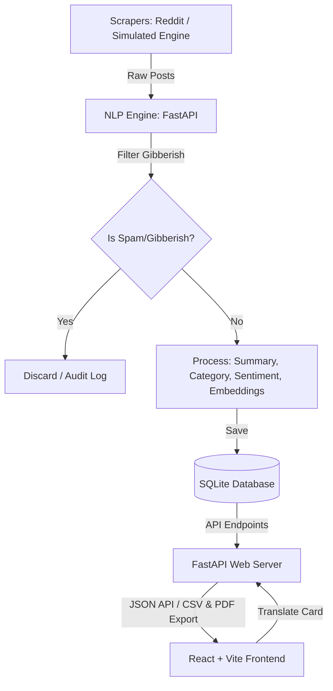

# Passport Social Media Scraper Dashboard

A full-stack social media aggregator and analytics dashboard that tracks, filters, translates, clusters, and summarizes passport-related social media posts from the last 24 hours.

Designed for **Zebvo Newswire Private Limited**, Jalandhar, Punjab, India.

---

## 🌟 Core Features

- **Real-Time & Simulated Aggregation**: Fetches real-time search threads from Reddit and generates simulated, contextual posts for Twitter/X, Facebook, Instagram, LinkedIn, YouTube, and TikTok (focusing on Jalandhar passport delays, Tatkal appointments, and visa queues).
- **Lightweight NLP Pipeline**:
  - **Gibberish Filter**: Detects letter/vowel distribution and repetitive spam to keep the dashboard clean.
  - **Auto-Categorization**: Scores text keywords to automatically assign posts to one of 10 categories (Tatkal, Visa, Appointments, Renewal, Scams, etc.).
  - **Lexicon Sentiment Analysis**: Labels post tone as Positive, Neutral, or Negative.
  - **Extractive Summary**: Generates concise, ~30-word summaries using Luhn frequency scoring.
  - **DBSCAN Clustering**: Clusters duplicates or highly similar reports into expandable threads.
- **Multilingual Support**: Translate any post into 10 target languages (English, Hindi, Punjabi, Spanish, French, German, Arabic, Chinese, Russian, Japanese) with a single click.
- **Data Visualizations**: Analytics widgets representing platform breakdowns, sentiment splits, and spam shield efficiency.
- **CSV & PDF Exports**: Download filtered results immediately.

---

## 🏗️ Architecture & Data-Flow



1. **Scraping**: A background task queries Reddit's public search API and runs the simulated engine to feed new posts into the system.
2. **NLP Engine**: Posts are cleaned. Non-English posts are translated to English temporarily for uniform analysis. The engine runs gibberish filtering, sentiment mapping, categorization, and summary extraction.
3. **Database Storage**: Saved to SQLite (`passport_dashboard.db`).
4. **Clustering**: A periodic job runs DBSCAN clustering on the TF-IDF representations of all active posts from the last 24 hours, grouping duplicate/similar posts.
5. **API Presentation**: FastAPI serves posts, stats aggregates, CSV/PDF files, and translations.
6. **Frontend**: The React client renders a glassmorphic dashboard calling the FastAPI server.

---

## 🚀 Setup & Execution

### Prerequisites
- Node.js (v18+) & npm
- Python 3.10+

### 1. Backend Setup
1. Navigate to the backend directory:
   ```bash
   cd backend
   ```
2. Create a virtual environment and activate it:
   ```bash
   python3 -m venv venv
   source venv/bin/activate
   ```
3. Install dependencies:
   ```bash
   pip install -r requirements.txt
   ```
4. Start the FastAPI server:
   ```bash
   uvicorn main:app --reload --port 8000
   ```
   *The server will run on `http://127.0.0.1:8000` and automatically create the SQLite database.*

5. Run Backend Unit Tests:
   ```bash
   python3 -m unittest test_backend.py
   ```

### 2. Frontend Setup
1. Navigate to the frontend directory:
   ```bash
   cd frontend
   ```
2. Install dependencies:
   ```bash
   npm install
   ```
3. Start the Vite development server:
   ```bash
   npm run dev
   ```
   *The client dashboard will run on `http://localhost:5173/`.*

---

## 🔌 API Endpoints Documentation

| Method | Endpoint | Query Parameters | Description |
| :--- | :--- | :--- | :--- |
| `GET` | `/api/posts` | `platform`, `category`, `sentiment`, `region`, `language`, `search`, `cluster_id`, `is_gibberish`, `sort_by`, `sort_order` | Retrieves aggregated posts filterable and sorted. |
| `GET` | `/api/posts/{id}/translate` | `lang` (e.g. `hindi`, `punjabi`) | Translates content of a specific post (DB cached). |
| `GET` | `/api/stats` | None | Returns aggregated counts for source platform, category, and sentiment metrics. |
| `POST` | `/api/scrape/trigger` | None | Forces an immediate scraping cycle. |
| `GET` | `/api/export/csv` | (Same filters as `/api/posts`) | Exports filtered posts as a CSV file. |
| `GET` | `/api/export/pdf` | (Same filters as `/api/posts`) | Exports filtered posts as a styled PDF report. |
